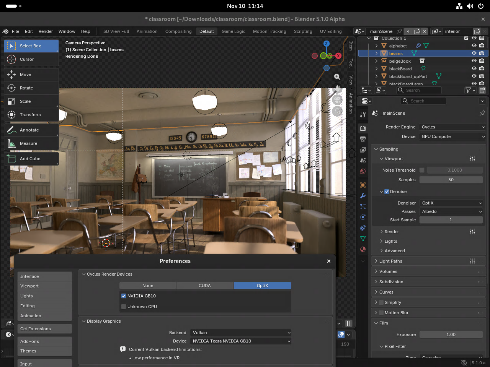

# Running Blender on ARM64 Linux with Vulkan

This guide explains how to compile Blender and the necessary dependencies from source to make it run on ARM64 Linux devices with CUDA, OptiX, and Vulkan, such as a GB10 system.

> [!TIP]
> A prebuilt binary for GB10 (DGX Spark) [is available here](https://github.com/CoconutMacaroon/blender-arm64/releases) (built by me, roughly using the build script)

## Rationale

While Blender does exist in the Ubuntu repos, it's an older version of Blender. Snap only supports AMD64, and [Backports](https://help.ubuntu.com/community/UbuntuBackports) aren't currently available.

## Current status

I've tested this on DGX OS 7. Depending on which options are selected, I've gotten up to 98% of Blender's tests to pass and Vulkan seems to work in Blender.

As a real-world test on a GB10 system, [the Classroom demo](https://www.blender.org/download/demo-files/#cycles) works with either CUDA or OptiX selected as the Cycles render device. OptiX denoising also works.


<sup>[Classroom](https://www.blender.org/download/demo-files/#cycles) by Christophe Seux. is licensed under CC0</sup>

## Building Blender from source

> [!CAUTION]
> As this process manually installs system files and packages, **it may break your installation of DGX OS** and/or create conflicts with certain packages.

1. Clone this repo and enter it:
   ```bash
   git clone https://github.com/CoconutMacaroon/blender-arm64.git
   cd blender-arm64
   ```
2. Run `bash ./builder.sh`
3. The first time you run it, you'll be prompted to download the NVIDIA OptiX SDK.
   1. Download it [from NVIDIA](https://developer.nvidia.com/designworks/optix/download)
   2. Move it from `~/Downloads` to `~/`
   3. Run the OptiX installer, and let it install into `NVIDIA-OptiX-SDK-9.0.0-linux64-aarch64`
4. Re-run `bash ./builder.sh`
  
   It should detect the OptiX SDK this time, and will build Blender's required dependencies and then Blender itself.
5. Once it builds Blender, run the provided launcher with
   ```bash
   ./launchBlender
   ```

## Notes

### Future modifications

If you want to modify the Blender build after the first time:
* Comment out `git apply spark.patch`, as the patch will have been applied already
* Comment out
  ```bash
  set +e
  make
  set -e
  ```
  While that creates the `build_linux/` directory, it's not necessary for future runs. Note that you *only* want to comment out the `make` between the `set +e` and `set -e`.

### Planned features

* Certain features, such as NumPy, OpenColorIO, and OpenSSL may not work out of the box, but should be possible.
* Running this from Docker would be potentially useful. Some brief testing indicated additional work is necessary for OptiX and Vulkan to work, although CUDA seemed to function correctly.

### Troubleshooting
* If it crashes when you run it, see [this](https://devtalk.blender.org/t/ubuntu-24-04-build-from-source-blender-crashes-at-startup/40853/10).
* Certain apt packages, especially those relating to oneTBB, may create conflicts, so a fresh DGX OS installation may be easier.
